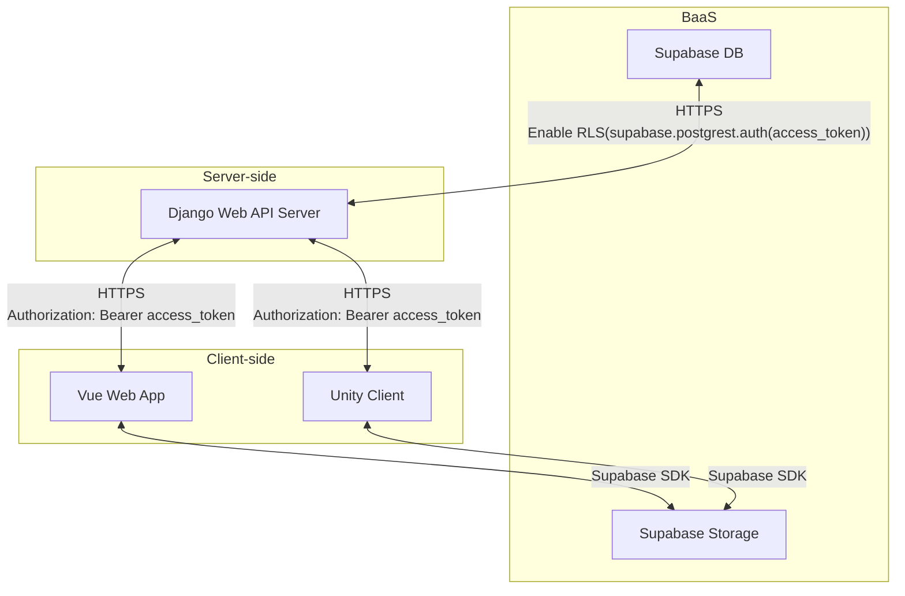

```mermaid
flowchart TB
    subgraph BaaS
        S[Supabase DB]
        T[Supabase Storage]
    end

    subgraph Server-side
        D[Django Web API Server]
    end

    subgraph Client-side
        V[Vue Web App]
        U[Unity Client]
    end

    S <--> |"HTTPS<br/>Enable&nbsp;RLS(supabase.postgrest.auth(access_token))"| D
    D <--> |"HTTPS<br/>Authorization:&nbsp;Bearer&nbsp;access_token"| V
    D <--> |"HTTPS<br/>Authorization:&nbsp;Bearer&nbsp;access_token"| U
    V <--> |"Supabase SDK"| T
    U <--> |"Supabase SDK"| T
```
