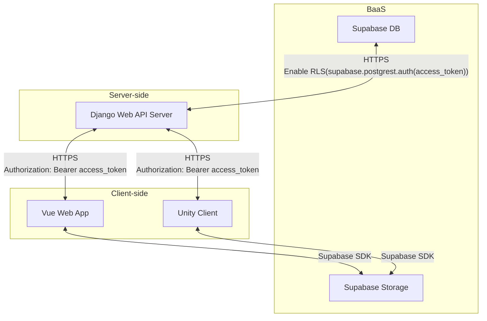

# Architecture

## Storage Access Rationale
Major hosting platforms such as Vercel and Netlify cap request bodies at roughly 5–8 MB.
For file upload and download flows, prefer letting clients talk directly to Supabase Storage via the SDK instead of proxying through the Web API server.

## System Diagram

## Reference Links
- https://vercel.com/kb/guide/how-to-bypass-vercel-body-size-limit-serverless-functions
- https://answers.netlify.com/t/file-upload-limits-on-forms/136798
